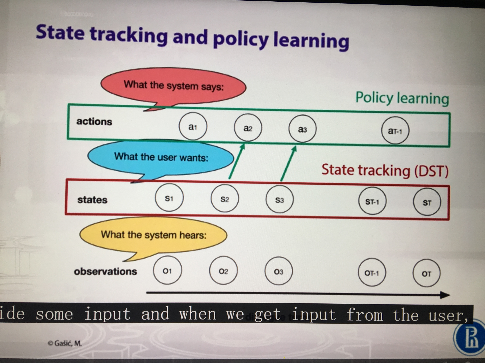

State tracker (requires hand-crafted states)  
--Queries the external database of knowledge base   
--Tracks the evolving state of the dialog  
--Constructs the state estimation  

 
Policy learner   
--Takes the state estimation as input and chooses a dialog action  

 

 