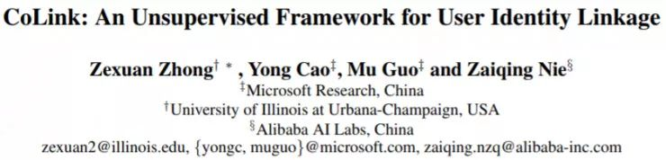
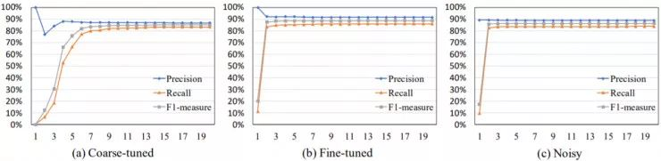
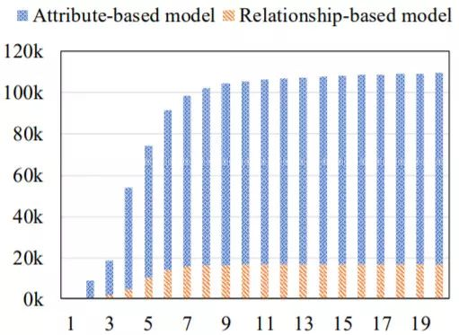
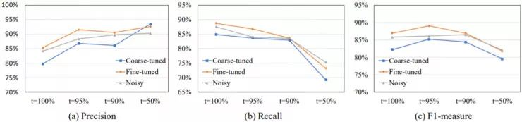
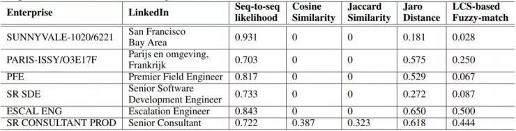

AI 科技评论按：阿里巴巴有 11 篇论文被 AAAI 2018 录用，分别来自机器智能技术实验室、业务平台事业部、阿里妈妈事业部、人工智能实验室、云零售事业部，其中有 5 位作者受邀在主会做 Oral&Spotlight 形式报告，另有 1 位作者携两篇论文在主会以 Poster 形式做报告。论文内容涉及对抗学习、神经网络、提高轻量网络性能的训练框架、机器翻译、聊天机器人、无监督学习框架、极限低比特神经网络等技术方向。

以下为阿里巴巴 AI Lab 与微软研究院、伊利诺伊大学厄巴纳-香槟分校的合作论文解读投稿。

摘要:

将几个子知识图谱上的同一实体信息链接在一起（也被称为用户身份链接（UIL）问题）对很多应用而言都至关重要。实体链接问题有两大主要难点。

第一，收集人工链接的实体信息对（user pairs）作为训练数据的成本非常高昂。

第二，不同子知识图谱的实体属性通常有非常不同的定义方式和格式，这使得属性对齐（attribute alignment）非常困难。

我们在本论文中提出了 CoLink，一种用于实体信息链接问题的通用型无监督框架。CoLink 使用了一种能同时操作两个独立模型（基于属性的模型和基于关系的模型）的协同训练算法，并且能以无监督学习的方式迭代式地让两个模型彼此互相增强。我们还提出使用「序列到序列」学习作为基于属性的模型非常有效，这种方法能将属性对齐难题当作机器翻译问题处理。我们将 CoLink 应用到了将企业网络中的员工映射到他们的领英（LinkedIn）个人资料的实体信息链接任务上。实验结果表明 CoLink 在 F1 分数上的表现超过之前最佳的无监督方法的 20% 以上。

引言:
将不同子知识图谱上的同一实体信息链接起来（也被称为用户身份链接（UIL）问题）通常能得到对该实体的更好和更深度的理解，这通常又能进一步得到更好的商业智能。

尽管机器学习算法已经在实体链接问题上得到了广泛的应用，但训练数据的标注工作并不简单。首先，寻找已链接实体信息配对是极其耗时的，因为这需要搜索所有子知识图谱以及仔细评估大量候选配对。另外这个工作还需要人类标注者具有广泛的领域知识。其次，由于隐私保护的原因，并非所有知识图谱的实体数据都可以提供给人类标注者，尤其是当这些资料来自个人社交网络或企业内部网络时。

在两个子知识图谱之间链接实体需要仔细比对两个子图谱中的实体属性，比如名称、职位、位置等。因此，属性值的对齐对实体链接问题而言至关重要。但是，传统的字符串相似度函数有两个不足之处：

没有一个通用方法可以处理相同属性在不同实体网络中的变化

无法找到隐式的属性对应关系

在这篇论文中，我们提出了一种用于实体链接问题的通用型无监督框架 CoLink。知识图谱中的实体数据可以自然地划分为两个独立的角度的特征：属性和关系，这完美契合协同训练（co-training）算法的要求。

CoLink 使用两个独立的模型：一个基于属性的模型和一个基于关系的模型。基于属性的模型和基于关系的模型都是二元分类器，决定两个实体是否能链接起来。它们可以基于任何机器学习或启发式算法。因此，只要知识图谱资料中包含属性和关系，那就可以将 CoLink 应用于该知识图谱的实体链接问题上。

更进一步，我们在 CoLink 的基于属性的模型的实现中使用了「序列到序列」学习算法，这为不同实体网络之间的属性对齐提供了一种通用方法。我们没有将属性对齐当成字符串相似度比较而进行处理，而是试图将一种「语言」（一种特定风格的网络）的属性值「翻译」成另一种「语言」。缩略语、缩写、同义词甚至隐式对应关系都可被视为翻译的特殊情况。我们选择「序列到序列」算法的原因是其已经表现出了在机器翻译任务上的有效性。具体而言，「序列到序列」方法有两种可用于 CoLink 的优势。首先，它几乎无需手动提取特征就能自动得到词层面的映射和序列层面的映射。其次，它只需要正例（已对齐的属性对）作为训练数据，这能减轻采样负例的工作。

我们将 CoLink 应用到链接社交网络的相同用户的任务上，其中我们试图将企业网络中的员工和他们的领英个人资料链接起来。我们进一步比较了 CoLink 和之前最佳的无监督方法。实验结果表明 CoLink 在 F1 分数上的表现总体上能超过之前最佳的无监督方法的 20%。我们的贡献总结如下：

我们最早将协同训练算法用在了知识图谱实体链接的问题上。由于实体网络中的实体属性和实体关系是自然分开的，这使得协同训练是一种完美且无成本的解决方案。

我们最早将属性对齐问题建模为机器翻译。我们使用「序列到序列」方法作为基于属性的模型的基础，这几乎无需提取特征就能实现很好的泛化。

我们进行了大量实验，比较了我们提出的方法和之前最佳的无监督方法，列举了不同的设置和模型，结果表明了我们提出的解决方案的有效性。

CoLink  

问题定义:

知识图谱上的实体链接问题定义为：其输入包括一个源知识图谱和一个目标知识图谱。其输出为一个实体链接对集合，表示从源图谱中链接到目标图谱中的实体对。

CoLink 框架

CoLink 框架基于如算法 1 所示的协同训练算法。我们在该框架中定义两个不同的模型：一个基于属性的模型 fatt 和一个基于关系的模型 frel。这两个模型都会进行二元分类预测，将一组给定实体对分类为正例（链接的）或负例（非链接的）。该协同训练算法以迭代的方式不断增强这两个模型。在每一次协同训练迭代过程中，两个模型都会使用已链接配对集 S 进行再训练。然后使用这两个模型生成的高质量的已链接配对会被合并到 S 中以用于下一次迭代，直到 S 收敛。在最开始时，需要一个初始的已链接配对集（简称种子集）来启动这个协同训练过程，这个集合可以通过一组种子规则生成。根据模型所用的算法，基于属性的模型和基于关系的模型的训练可能会需要负例。算法 1 中没有给出采样负例的过程。

这个协同训练算法不会修改之前的迭代中生成的已链接配对。因此由之前的迭代引入的误差不会在后面得到修复。这种算法的一种替代方案是在协同训练收敛之后进行一次最终修改。即使用该协同学习过程所得到的最终模型来重构 S。

种子规则:   

该协同训练算法的启动需要一个已链接实体对构成的小型种子集。获取种子集的一种简单直接的方法是根据人工设计的规则来生成，我们称之为种子规则。这些种子规则可以考虑来自目标知识图谱的以下事实：

实体名称唯一性

实体属性值映射

实体关系传播

种子规则的选取会直接影响 CoLink 的表现。

基于属性的模型:   

基于属性的模型通过考虑实体的属性来预测链接的实体对。它可以使用任何分类算法。在这篇论文中，我们尝试了两种不同的机器学习算法：「序列到序列」和支持向量机（SVM）。

序列到序列:   

由于属性有不同的变化形式，所以传统的字符串相似度方法在处理属性对齐方面表现很差。由于属性对齐类似于机器翻译问题，所以我们采用了「序列到序列」方法。缩略语、缩写、同义词甚至隐式链接都可被视为翻译的特殊情况。

我们采用了 Sutskever, Vinyals, and Le (2014) 提出的「序列到序列」网络结构。该网络由两部分构成：序列编码器和序列解码器。编码器和解码器都使用了深度长短期记忆（LSTM）架构。编码器深度 LSTM 会读取输入序列并求出每个词位置的表示向量。然后这些向量会被送入一个注意层（attention layer），从而得到一个考虑了输出词位置的输入序列的整体表示。然后解码器深度 LSTM 的隐藏状态会进一步被送入一个全连接层（其输出包含词汇库大小的维度信息），进而预测输出词。

我们按照之前的工作，使用已链接属性值配对训练了「序列到序列」网络。但是，我们不是使用网络预测输出序列，而是在 CoLink 中使用所学习到的「序列到序列」网络来进行二元分类。首先，我们使用该网络求出对于一对属性匹配的概率。然后，我们选择一个匹配概率阈值，超过该阈值的实体对被认为是有链接的。

支持向量机:  

SVM 等传统的分类算法也可以用在基于属性的模型中。不同于只需要正例训练样本（已链接配对）的「序列到序列」方法，SVM 还需要负例。因为用户配对空间非常大，所以正例在整个空间中实际上非常稀疏。在每次联合训练迭代中，给定已链接配对，我们还会选择同等数量的随机实体对作为负例。

基于关系的模型:   

基于关系的模型仅使用实体关系来预测链接实体对。只根据关系来寻找两个网络中同等结点的问题通常被称为网络对齐问题。

基于关系的模型可以使用任何基于关系的网络对齐模型。因为本文的重点是协同训练算法和「序列到序列」的基于属性的模型，所以我们在本论文中使用了一种简单的启发式模型，该模型基于一个假设：如果两个来自不同网络的实体都具有大量互相关联的已链接实体，那么这两个实体很可能也是链接的。

实验:   

我们的实验比较了 CoLink 与当前最佳的无监督方法。我们还研究了种子规则和链接概率阈值的选择，以更好地理解它们对链接结果的可能影响方式。

数据集:   

我们选择了一个真实数据集来评估 CoLink，它包含两个社交网络。其中一个社交网络是领英，另一个网络是一个企业内部用户网络。

候选实体对的选择:  

我们构建了一个候选实体对过滤器，它能移除大量不可能链接的实体对。该候选项过滤器考虑了以下属性。

实体名

组织机构

在过滤之后，我们得到了 758046 个候选实体对，其涵盖了测试集合中所有有链接的配对。

 序列到序列:   

 我们实验中的「序列到序列」网络由一个带注意网络的深度 LSTM 编码器和一个深度 LSTM 解码器构成。编码器深度 LSTM 和解码器深度 LSTM 都有 2 个层叠的 LSTM，因为我们发现对于实体链接任务而言，超过 2 层的编码器或解码器不能再带来更多提升。每个 LSTM 的循环单元大小为 512。每个词在被送入编码器和解码器之前都首先会被转换成一个 512 维的嵌入向量。「序列到序列」模型的训练时间取决于训练数据的规模。平均而言，使用一个 Tesla K40 GPU，让模型在 10 万个属性配对上完成训练需要 30 分钟。

  种子规则:   

  为了测试 CoLink 的稳健性，我们尝试了下列 3 个种子规则集：

..粗略调整的集合

..精细调整的集合

..有噪声集合

协同训练:   

我们通过将关系特征和属性特征分开而使用了协同训练。基于属性的模型和基于关系的模型都能在每次迭代中找到新配对然后增强彼此。图 2 给出了每个模型所得到的已链接配对的统计情况。在这项任务中，基于属性的模型生成的配对比基于关系的模型多，这是因为我们没有完整的领英关系数据。我们爬取了公开的领英个人资料中的「人们还看了」列表，这只能为每位用户提供不到 10 个关系。

概率阈值 :   

图 3 给出了不同阈值的比较情况。使用更严格的阈值（更小的百分数）会得到更高的精度和相对更低的召回率。我们在本任务中选择的阈值是 95%。

 比较结果:   

 

 属性对齐:   
通过使用「序列到序列」方法，CoLink 可以处理使用传统字符串相似度函数难以应付的属性对齐问题。表 3 给出了一些选择出的应该是对齐的属性示例以及来自不同方法的相似度分数（全都位于 [0,1] 区间中）。在「序列到序列」的帮助下，几乎无需提取特征，就可以轻松地将这种方法应用于其它实体匹配任务。

 

