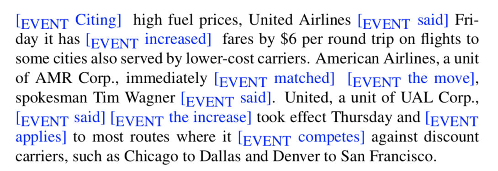
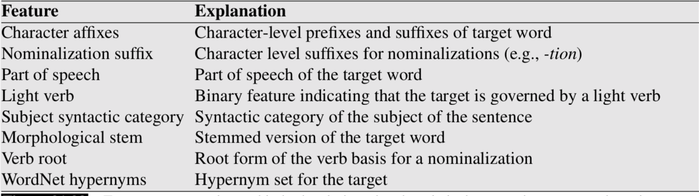
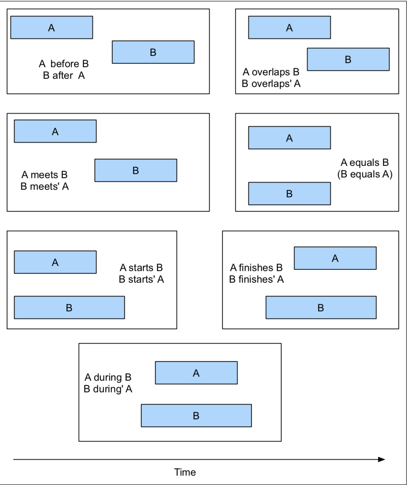
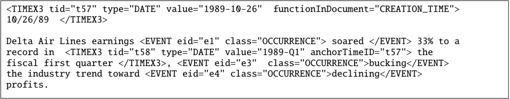
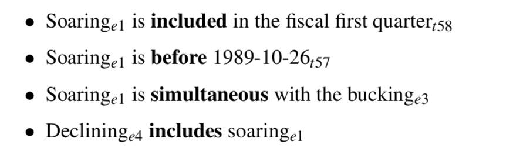

事件抽取的任务是识别文本中的mentions。 
事件的mention表示事件或者状态，事件或者状态分配给特殊的点，间隔或者时间。 

 
在英文中，事件的mentions一般都是动词（verbs），大多数的动词都表示出现了事件。 
然而，从例子中我们可以看出，并不是所有的事件的mentions都是动词。 
事件的mentions可以是名词短语（noun phrases），比如the move，the increase， 
一些动词并不能表示事件，比如动词短语（phrasal verb）took effect,took effect表示事件的开始而不是事件本身。 
 
同样的，light verbs通常也不能表示事件，比如make,take. 

在这些例子中，动词为事件表示参数简单的提供了语法结构，例如took a flight。 
根据不同的目标，有不同的事件抽取版本。 
比如TempEval shared tasks(Verhagen et al.2009)的目标是抽取aspectual（貌）和temporal properties（临时属性）。 

事件分为action,states,reporting events(say,report,tell,explain),perception events,等等。 

同时，也需要抽取aspect,tense,modality(形态)。 

因此，对于不同的事件都要进行标注（class=REOORTING，tense=PAST,aspect=PERFECTIVE）. 

事件抽取通常通机器学习进行建模，通过序列模型，多分类分配事件类型和属性进行事件探测，序列模型都进行了IOB标注。 

通用特征包括词性标注（parts of speech）,词法（lexical items）和动词时态信息（verb tense information）. 

 
Features commonly used in both rule-based and statistical approaches to event detection. 

事件的事件顺序（Temporal Orderign of Events） 
探测文本中的事件和时间顺序之后，接下来就是逻辑任务，用信息去填充事件到一个完整的时间轴当中。 
这个时间轴对很多应用都是有用的，比如问答系统和摘要任务。 

一个简单有效的任务就是产生事件的局部顺序和时间表达式。这个时间序列可以提供一些对时间时间轴有利的信息。 

这种序列关系可以看作为是二元关系的抽取和分类任务。 

有一种比较通用的方法解决这个问题，那吉居士Allen的时间关系理论。 

大部分系统利用统计分类，在TimeBank数据上进行训练。 

使用的数据特征有words,parse paths,tense,aspect. 

 

TimeBank语料由很多文本标注组成，TimeBank1.2由从不同的源数据中选出了183篇新闻文章。 

TimeBank中每篇文章都由标注时间表达式（temporal expressions）和事件mentions。 

另外，TimeML提供时间表达式和事件之间的时间链接（temporal links）并标明它们之间的关系。 

 

下面的例子是时间关系标注的例子： 

