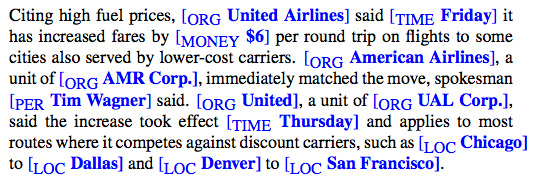

命名实体:信息抽取的第一步就是再文本中抽取实体.

命名实体通常指人名(a person,),地名(a location),组织名(an organization).
后来扩展到不仅是实体,还包括时间(times),日期(dates),其他形式的时间表达式(temporal expressions),
甚至是数字表达式(numerical expressions),比如说价格(prices).

下图为早期命名实体标记的文本: 

