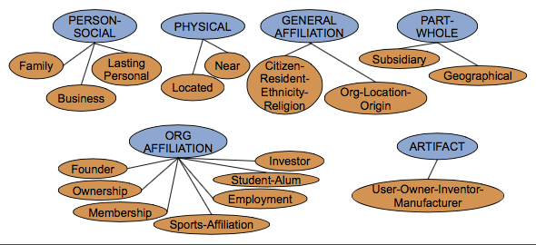
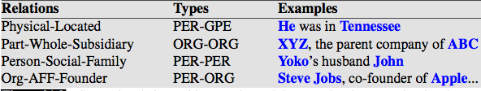
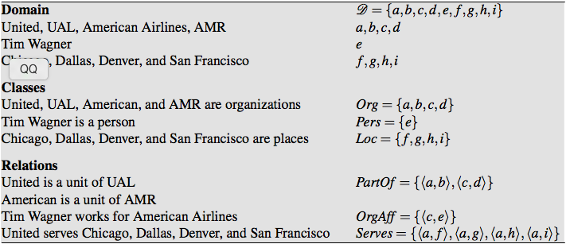

关系抽取:辨别实体间存在的关系.

文本示例:
Citing high fuel prices, [ORG United Airlines] said [TIME Friday] it has increased fares by [MONEY $6] per round trip on flights to some cities also
served by lower-cost carriers. [ORG American Airlines], a unit of [ORG AMR Corp.], immediately matched the move, spokesman [PER Tim Wagner] said.
[ORG United], a unit of [ORG UAL Corp.], said the increase took effect [TIME Thursday] and applies to most routes where it competes against discount carriers,
such as [LOC Chicago] to [LOC Dallas] and [LOC Denver] to [LOC San Francisco].

文本示例叙述了以下事实:
Time Wagner是美国航空发言人;
United是UAL公司的一部分;
美国航空是AMR的一部分;

以上二元关系是一般关系的示例,如part-of,part-of关系在文本中用的相当频繁.

下图为列举出ACE关系抽取中17种关系类型:

下图为关系示例:

也有一些领域关系,如航空路线的概念.
从文本中可总结出,United有到Chicago, Dallas, Denver和San Francisco等等的航线.

关系由领域顺序元组组成,领域元素相当于文中的命名实体.实体来与共指消解的结果,或者来源于领域本体中的实体.
下图为基于模型的实体和关系示例.

