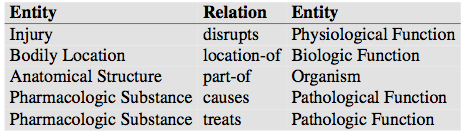
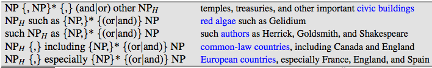

关系抽取:辨别实体间存在的关系.

文本示例:
Citing high fuel prices, [ORG United Airlines] said [TIME Friday] it has increased fares by [MONEY $6] per round trip on flights to some cities also
served by lower-cost carriers. [ORG American Airlines], a unit of [ORG AMR Corp.], immediately matched the move, spokesman [PER Tim Wagner] said.
[ORG United], a unit of [ORG UAL Corp.], said the increase took effect [TIME Thursday] and applies to most routes where it competes against discount carriers,
such as [LOC Chicago] to [LOC Dallas] and [LOC Denver] to [LOC San Francisco].

文本示例叙述了以下事实:
Time Wagner是美国航空发言人;
United是UAL公司的一部分;
美国航空是AMR的一部分;

以上二元关系是一般关系的示例,如part-of,part-of关系在文本中用的相当频繁.

下图为列举出ACE关系抽取中17种关系类型:

下图为关系示例: 

也有一些领域关系,如航空路线的概念.
从文本中可总结出,United有到Chicago, Dallas, Denver和San Francisco等等的航线.

关系由领域顺序元组组成,领域元素相当于文中的命名实体.实体来与共指消解的结果,或者来源于领域本体中的实体.
下图为基于模型的实体和关系示例.

许多其它领域也定义了很多关系,比如UMLS(Unified Medical Language System),定义了134中广泛的主题分类(subject categories),
实体类型(entity types),54种实体之间的关系,如下图所示: 

给出医药句子如下:
Doppler echocardiography can be used to diagnose left anterior descending artery stenosis in patients with type 2 diabetes
可抽取UMLS关系:Echocardiography, Doppler Diagnoses Acquired stenosis

infoboxs: 
维基百科的infobox提供了大量关系,一些维基文章和机构化表关联.
维基包含结构化事实,比如 state = "California";
president = "John L. Hennessy".
这些事实可转化为关系,比如president-of或者located-in.
或者转化为RDF中的关系,RDF(Resource Description Framework).
一个RDF元组由实体-关系-实体(entity-relation-entity)组成.
也叫做主谓宾(subject-predicate-object).

RDF元组示例: 
      subject           predicate            object    
Golden Gate Park        location            San Francisco    

DBpedia源于维基,包含20亿RDF元组.还有源于维基infobox的数据集. 
Freebase的关系如下: 

people/person/nationality  
location/location/contains  
people/person/place-of-birth  
biology/organism classification  

WordNet或者其它本体提供本体关系,这些关系表示词和概念间的层次关系.WordNet包含is-a或者上位词关系. 
Giraffe is-a ruminant is-a ungulate is-a mammal is-a vertebrate is-a an- imal. . .

WordNet个体和类之间也有Instance-of的关系,比如San Francisco和city的关系是Instance-of.抽取这些官谢是在新语言和领域中扩展本体和构建本体的重要步骤
.
关系抽取有4种主要的算法: 
hand-written patterns   
supervised machine learning  
semi-supervised  
unsupervised   

一.模板抽取关系 
早期关系抽取使用的的模板,由Hearst在1992你那提出. 
假设有如下句子: 
Agar is a substance prepared from a mixture of red algae, such as Gelidium, for laboratory or industrial use.

Hearst指出大部分人不知道Gelidium是什么,但能推理出它是红藻(red algae).她提出西面的模式(lexico-syntactic pattern):

NP0 such as NP1{,NP2 ...,(and|or)NPi},i ≥ 1   

寓意着以下语义:  
∀NPi,i ≥ 1,hyponym(NPi,NP0)  

可推理出:
hyponym(Gelidium,red algae)   

