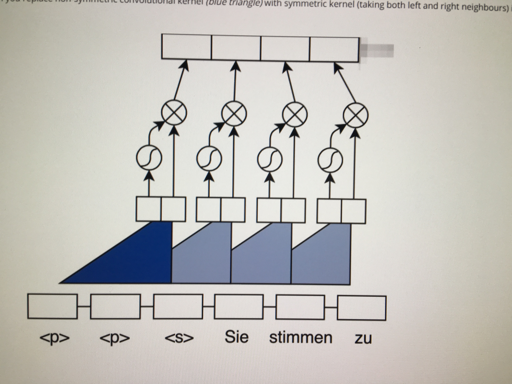
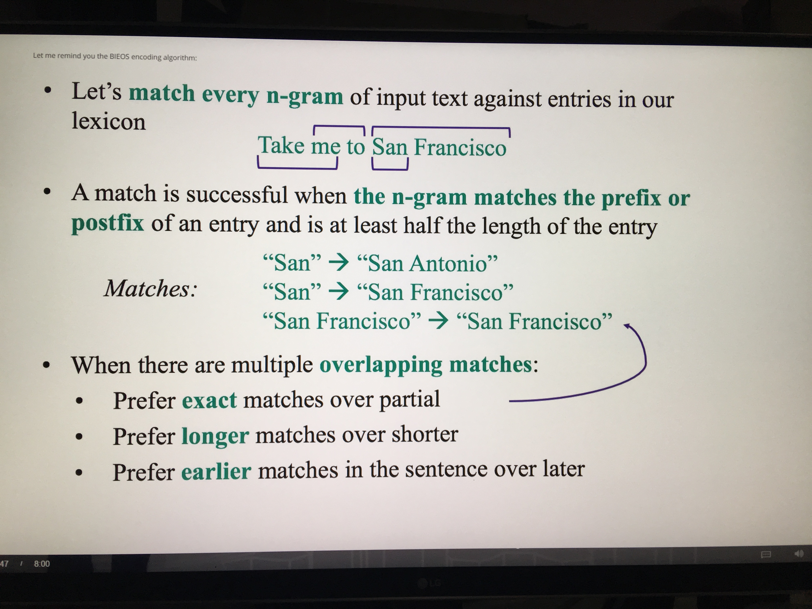
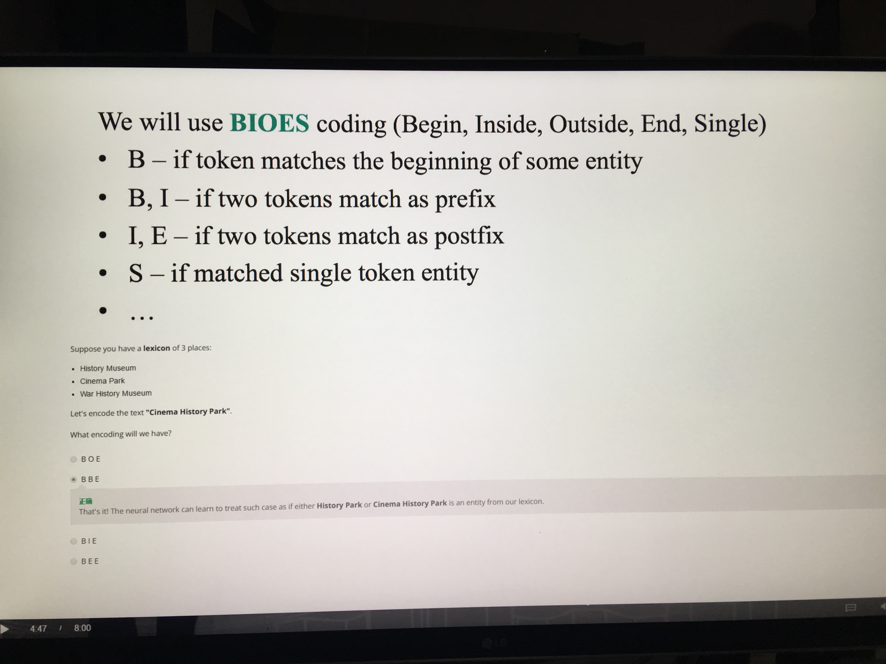

How do you train a sequence tagger in BIO scheme?   
A.Optimise cross-entropy for every time step.   
B.Optimise accuracy for every time step.   
C.Optimise accuracy for the whole sequence.   

答案：A

 
 
 
 Slot tagger  
 --What you can do:   
    ~Handcrafted rules like regular expressions   
    ~CRF    
    ~RNN seq2seq   
    ~Any seq2seq with attention   
    

Can you replace non-symmetric convolutional kernel (blue triangle) with symmetric kernel (taking both left and right neighbours) in  
this architecture for language modeling?  

 
A.Yes   
B.No    
答案：B

Let's add lexicon features to input words  
~Let's match every n-grame of input text against entries in our lexicon  

 
~A match is successful when the n-gram matches the prefix or postfix of an entry and is at least half the length of the entry  
Matches:   
"San"--->"San Antonio"   
"San"--->"San Francisco"   
"San Francisco"--->"San Francisco"   

When there are multiple overlapping matches:  
~Prefer exact matches over partial   
~Prefer longer matches over shorter   
~Prefer earlier matches in the sentence over later  

 
 
 
 